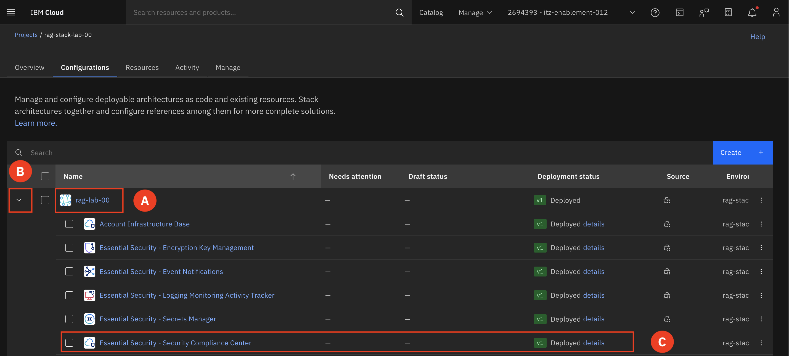
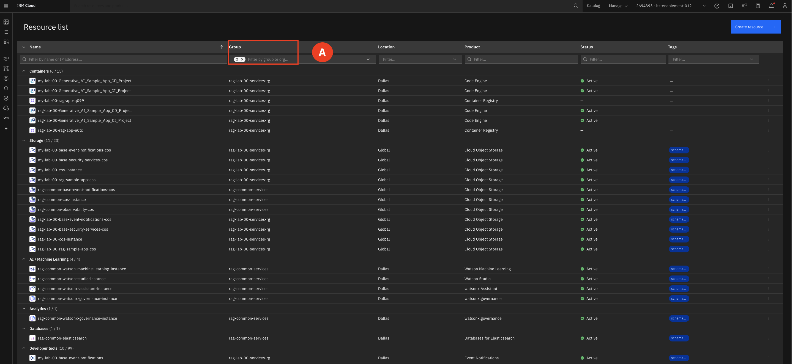

# View Deployed Project

---

In this section we will be viewing the already deployed stack. We will take a closer look at a couple different layers of the stack to gain a better understanding of what is being created at that layer of the DA. 

---

1. In the Projects view, inside your rag-stack-lab-## that corresponds to your group number **(A)**.   
For example: rag-lab-00

    Click the **arrow (B)** to expand the list of components. You are able to expand the colum size so you are able to see the full name of the components. Find the **Essential Security - Security Compliance Center** and select **Deployed details (C)**.  
    

    b. Select the arrow **(A)** to expand the Validation successful section. Click the green number that indicates the number of resources created to view the resources **(B)**. 
    

    c. Here is a list of created resources by that specific section of the DA. 
    

    Repeat the same steps for the **Workload - Sample RAG App Configurations** section of the DA. Use the breadcrumbs at the top left to navigate back to the project. 

2. Now let's look at the list of resources that have been created by the DA.  
    
    Expand the **Navigation menu (A)** on the upper right-hand corner. Select **Resource list (B)** from the Navigation menu.  

    Filter for your resource group (for example: rag-lab-00-service-rg) and **rag-common-services** under **Group (A)** to view all resources deployed by the DA.   

    You may have resources with a starting name of MY-lab, these are the resources that are currently being created by the DA you deployed at the beginning of the lab. 

