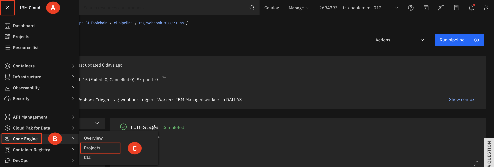
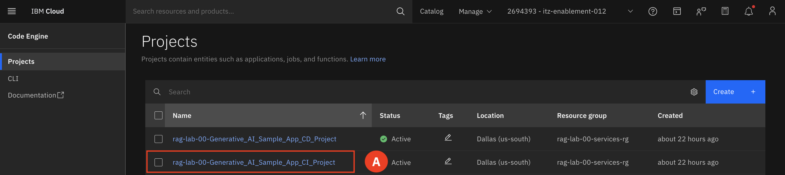
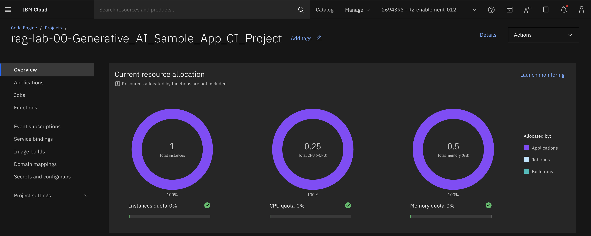

# Code Engine

The RAG DA deploys the sample Bank Loan application on IBM Code Engine. Code Engine is a fully managed, serverless platform that enables developers to build, deploy, and scale containerized applications and batch jobs without managing the underlying infrastructure. It automatically handles tasks such as scaling, monitoring, and maintenance, allowing developers to focus on writing code. IBM Code Engine supports multiple programming languages and containerization technologies, making it versatile for various application development needs.

1. Expand the **Navigation menu (A)**, hover over **Code Engine(B)** and select **Projects (C)**

2. Select the Sample_App_CI_Project that matches your project number. **(A)**  
For example: rag-lab-00-Generative-AI-Sample_App_CI_Project. 

3. Review the Overview dashboard 
