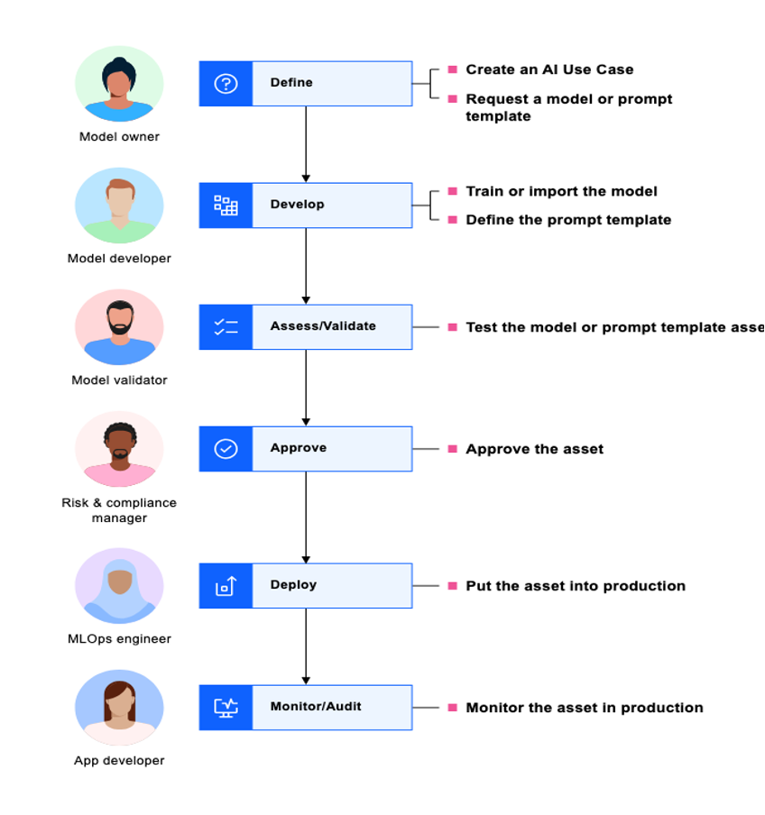
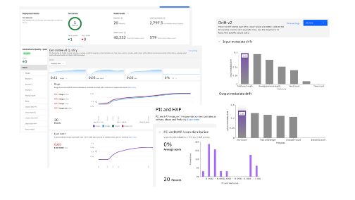

# Watsonx Governance

Watsonx Governance accelerates responsible, transparent and explainable AI workflows, including:
* Adhere to regulatory compliance by  translating growing regulations into enforceable policies.  How to operationalize AI with confidence 
* Manage risk and protect reputation by automating workflows to ensure quality and better detect bias and drift. 
* Govern across the AI lifecycle. Automate and consolidate tools, applications and platforms. Capture metadata at each stage and support models built and deployed in 3rd party tools.  

