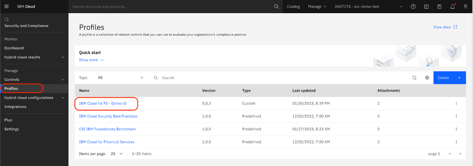
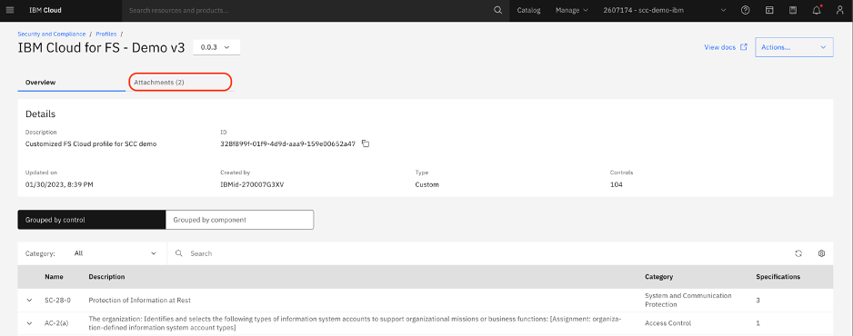
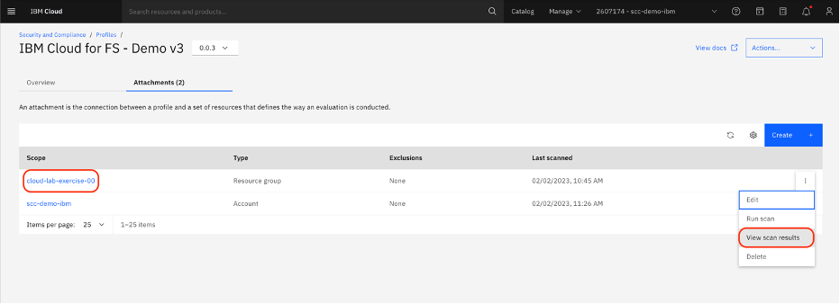
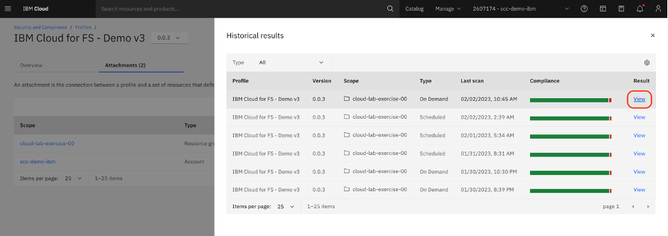
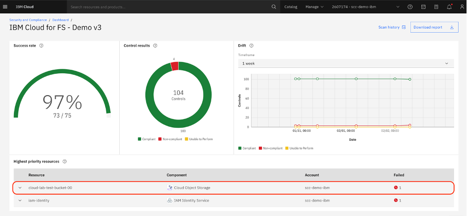
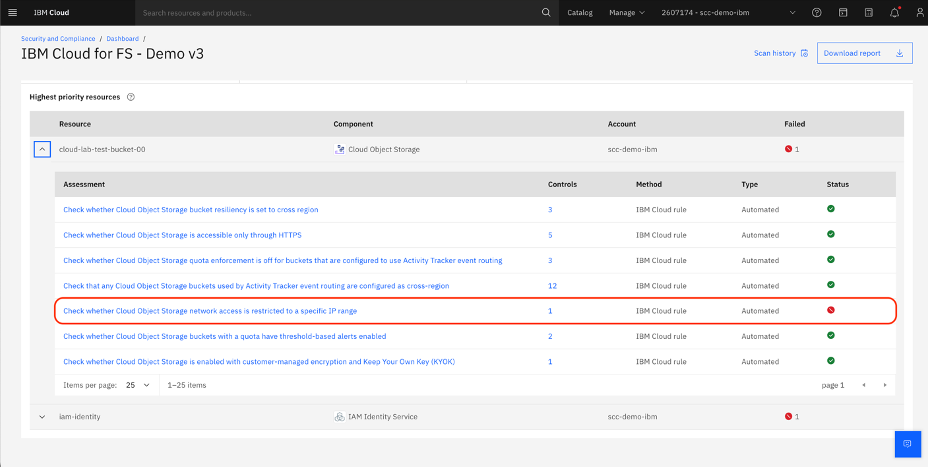

# Examine Scan Results for Noncompliant Resource

First, we will observe a resource failing a specification check. We will use an existing resource and an SCC scan due to timing of the exercise. 

1. Navigate to Profiles and select **the profile (A)**

2. Select **Attachments (A)** 

Attachments connect profiles and scopes to tell Security and Compliance Center what to evaluate. You then specify which parameters to examine. Attachments are checked daily or as needed.

3. Locate scope in the list. Next to the scope (the three dots), select View Scan results. 

Note: Please do not  hit run scan, we are only viewing.

A scope defines which resources in your accounts are evaluated. It is defined when you create an attachment by selecting the parent account or resource group that you want to evaluate.

4. Select View on the top (most recent) row 

5. Under Highest priority resources, you will see a failure for Cloud Object Storage. Expand the error for more details. 

6. The error is for an IP restriction on the Cloud Object Storage bucket.

