# Create Attachment and Run Scan

WRITE INTRODUCTION 

1. On the **Navigation menu (A)**, hover over **Security and Compliance Center (B)**, and select **Dashboard (C)**.

    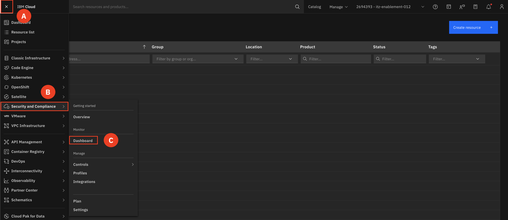

2. Make sure you are on the instance that corresponds to your group number

3. Navigate to **Attachments (A)** and click **Create (B)**

    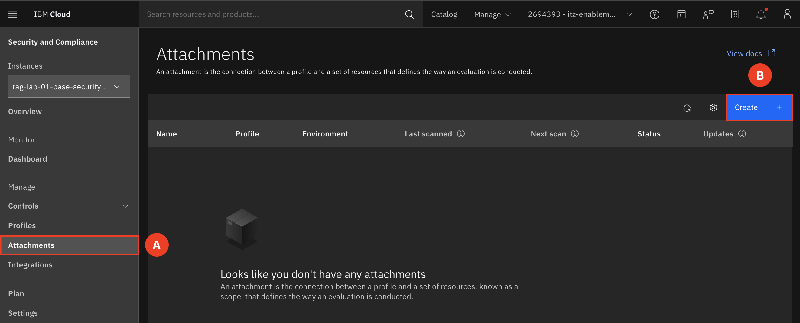

4. Configure your attachment  

    a. Give your attachment a name **(A)**, click **Next (B)**

    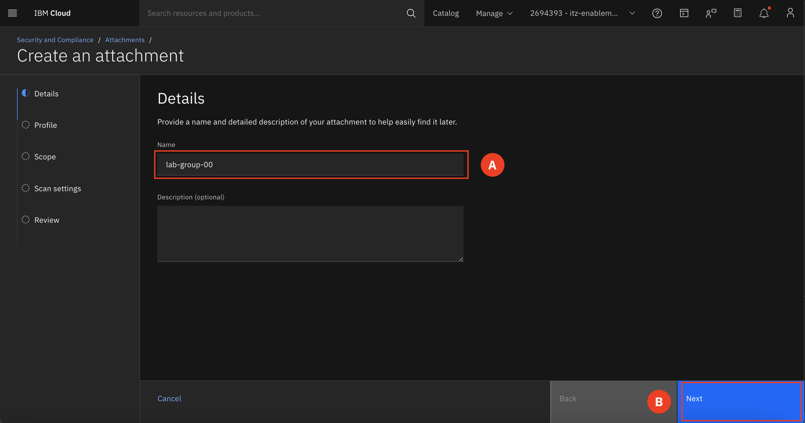

    b. Select the **AI ICT Guardrails 2.0 (A)** profile, click **Next (B)**

    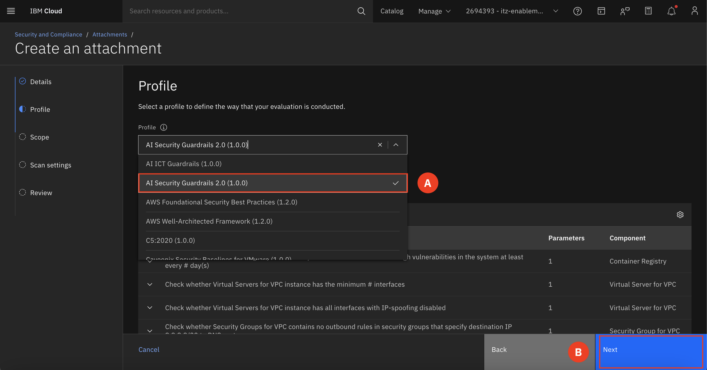

    c. Select your resource group for the **scope (A)**, click **Next (B)**

    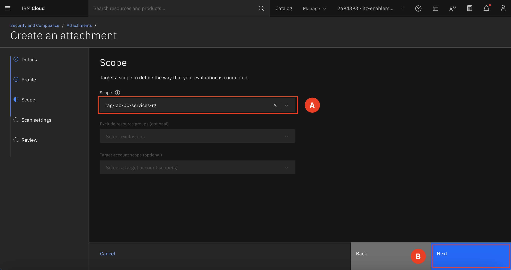

    d. Schedule: **none (A)**, click **Next (B)**

    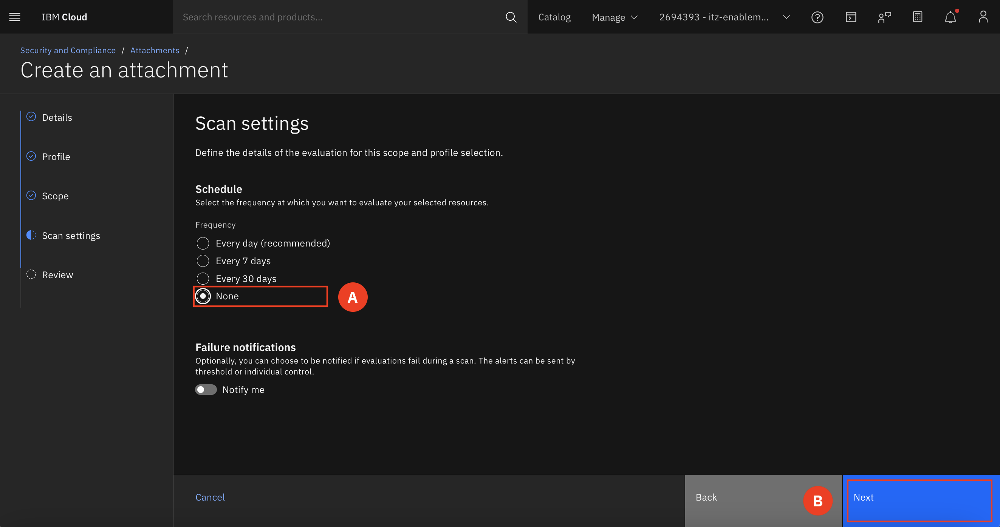

    e. Review and click **Create (A)**

    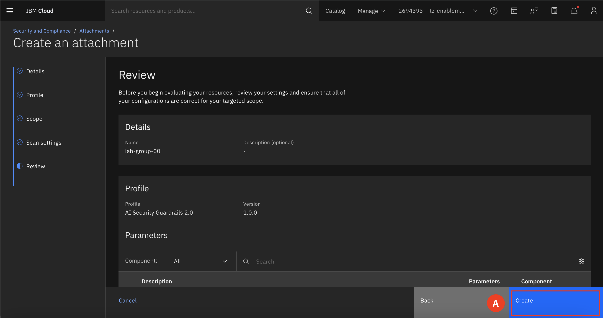

5. Select the **triple dot (A)** on the right-hand side of your newly created attachment and select **Run Scan (B)**. The scan will take about 5 minutes to run
    
    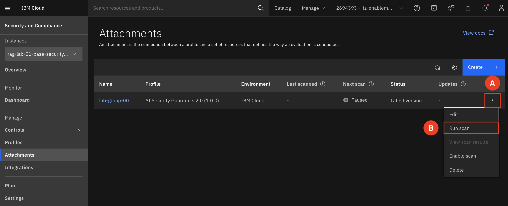

6. When your scan is complete, select the **triple dot (A)** on the right-hand side of your attachment and select **View Scan Results (B)**.

    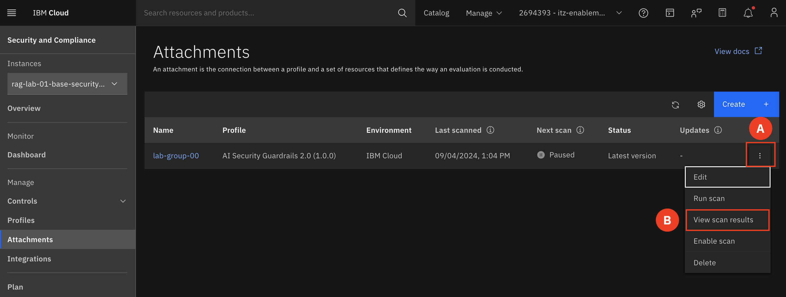

7. Click your scan to open the report **(A)**

    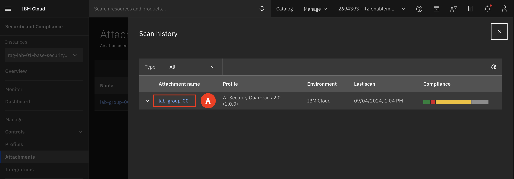

8. View the failed rules at the bottom on the Overview page and locate the Component ***Cloud Object Storage*** **(A)**  

    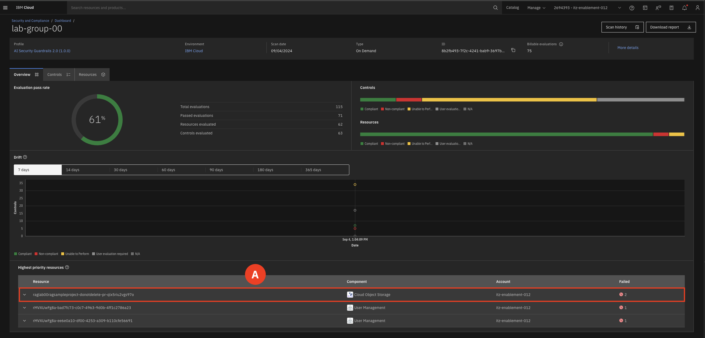

    You should see a rule that has failed with the Description: Check whether Cloud Object Storage can be accessed only through a private endpoint (Context-based restrictions or service) and allowed IPs **(A)**

    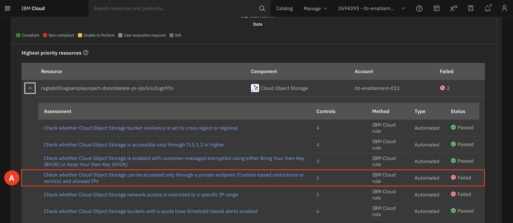

The reason this rule is failing is because the context-based restrictions rule is not configured with private endpoint-allowed IP addresses. We will now go through the steps on how to remediate this issue. 