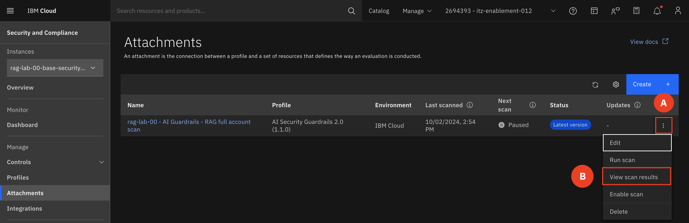
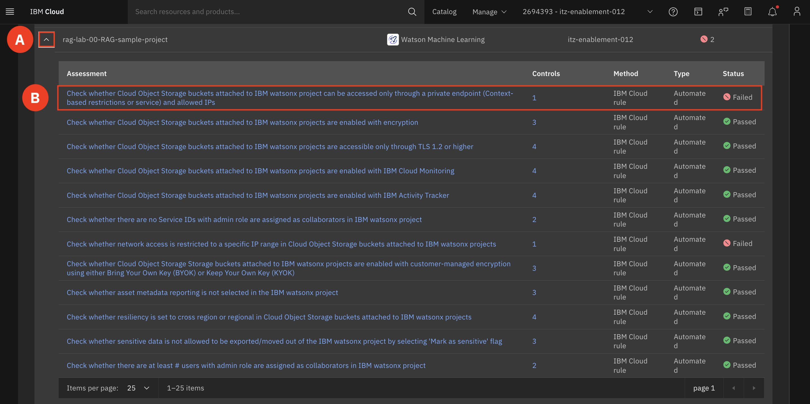

# View Scan Results

In this section, you will first view a scan that has already been ran on your environment. This scan will provide a report highlighting any resources that are not compliant with the enforced security and compliance policies, based on the IBM Cloud Framework for Financial Services and AI ICT Guardrails profiles. The goal is to identify which resource needs attention before moving on to resolving these issue.

1. Navigate to the Security and Compliance Center by selecting the **Navigation menu (A)**. Hover over **Security and Compliance Center (B)**, and select **Dashboard (C)**.

    

2. Make sure you are on the SCC instance that matches your group number **(A)**. Select **Attachments (B)**

3. View your scan results. Select the **triple dot (A)** on the right-hand side of your attachment and select **View Scan Results (B)**.

    

4. Click your scan to open the report **(A)**

    

5. In the list of noncompliant resources, find the project that matches your group number.  
For example **rag-lab-00-RAG-sample-project (A)**.  

    

   Expand the resource **(A)** You should see a rule this rule: Check whether Cloud Object Storage can be accessed only through a private endpoint (Context-based restrictions or service) and allowed IPs **(B)**

    

The reason this rule is failing is because the context-based restrictions rule is not configured with private endpoint-allowed IP addresses for Cloud Object Storage. We will now go through the steps on how to remediate this issue. 
