# Provision new Bucket with HPCS and IP address 

In this section you will provision your own resource with correct configuration that will pass the control specifications observed in the previous section. In the next section you will use that resource in your own SCC scan to demonstrate compliance. In real life scenarios you may be changing the configuration of existing resources that were flagged in SCC scans to address the non-compliance issues, but the timing of the lab session does not allow us to re-run the SCC scans after resource configuration has been modified.

1. Navigate to Resource List > Storage > Select cloud-lab-cos- xx

Note: xx is replaced with your group number. 

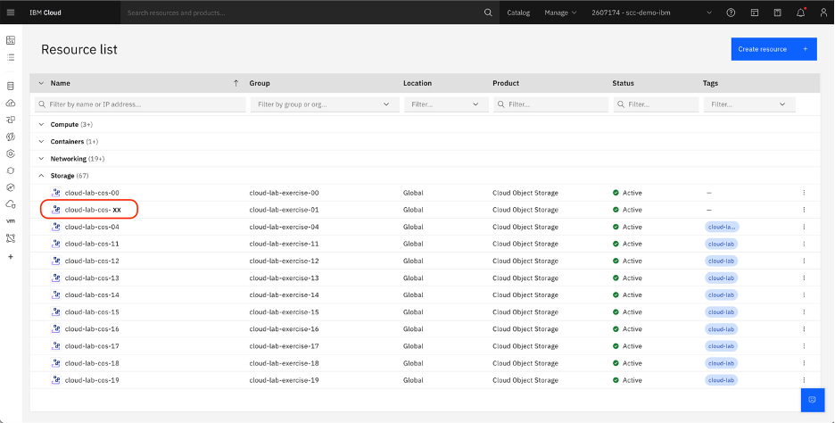

2. Select **Create bucket**

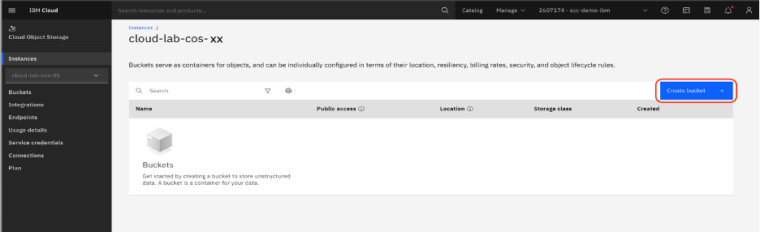

3. Select Customize your bucket 

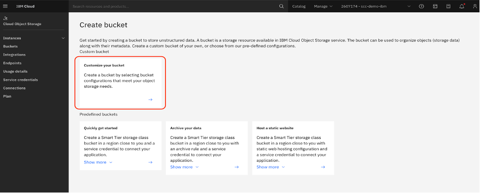

4. Configure your bucket
* Unique bucket name: cloud-exercise-xx-bucket
    * Note: xx is replaced with your group number. 
* Resiliency: Regional 
* Location: us-east
* Storage class: Smart Tier

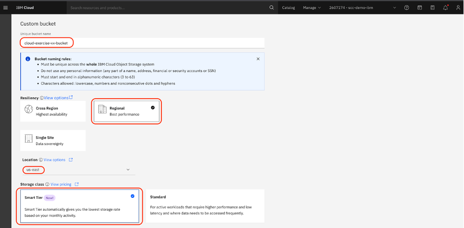

5. Under Service integrations, enable Encryption, select Hyper Protect Crypto Services and then click Use existing instance.

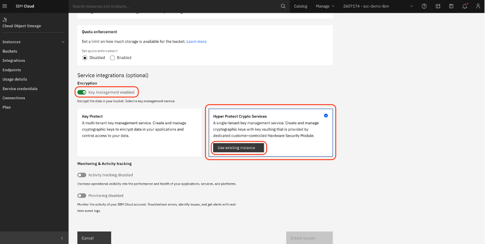

6. Make sure scc-demo-hpcs (us-east) is selected under Key Protect instance. Select the scc-demo-slz-key and then click Associate key.

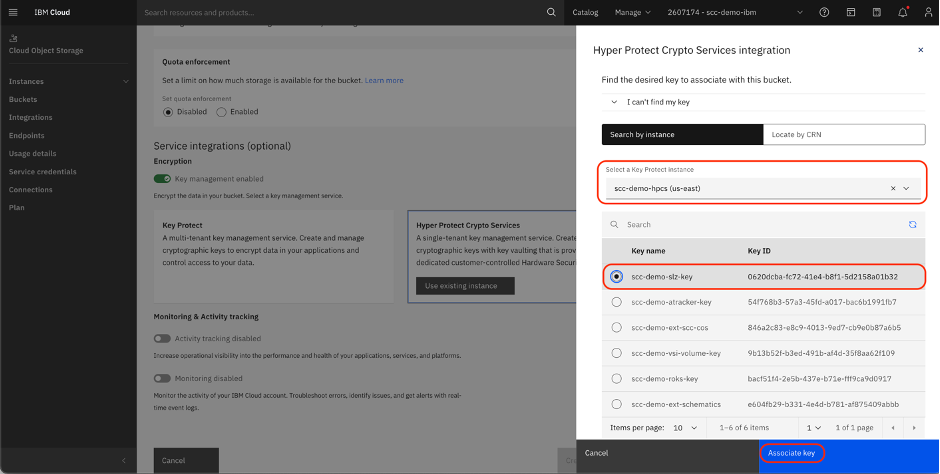

7. Click Create bucket

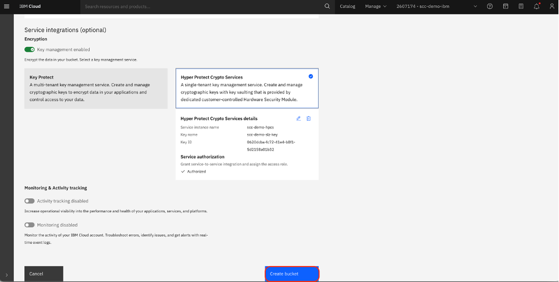

8. Your bucket is now created 

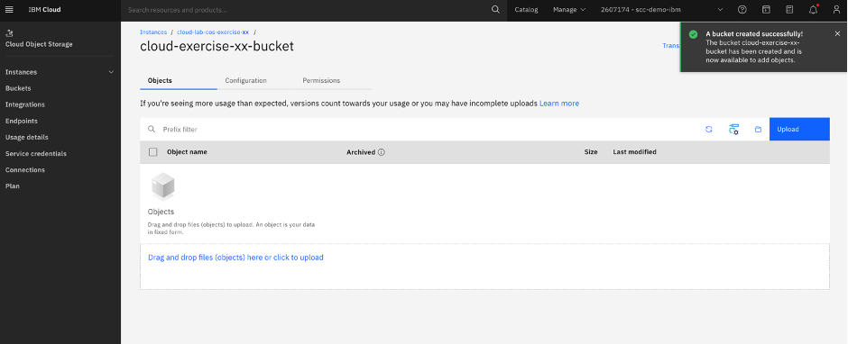

9. Select Permissions to update the IP address filter

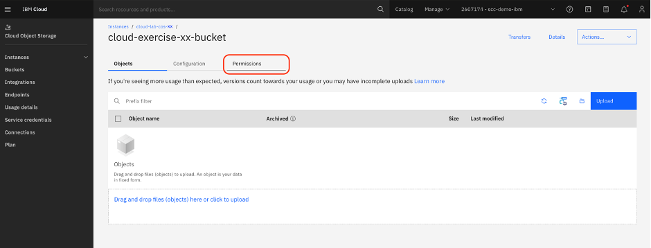

10. Expand Firewall

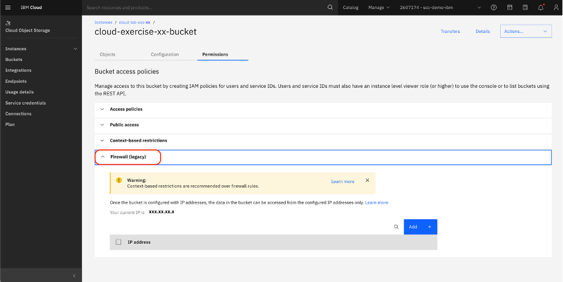

11. Click copy on Your current IP is and then click Add

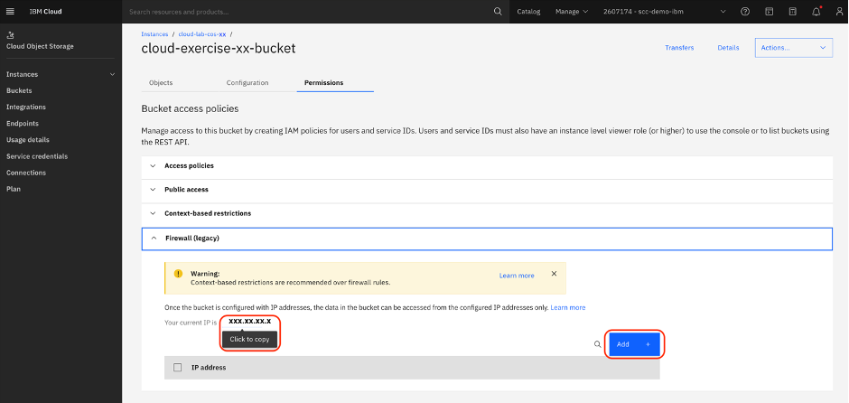

12. Paste your IP address and click Add

13. Click Save all

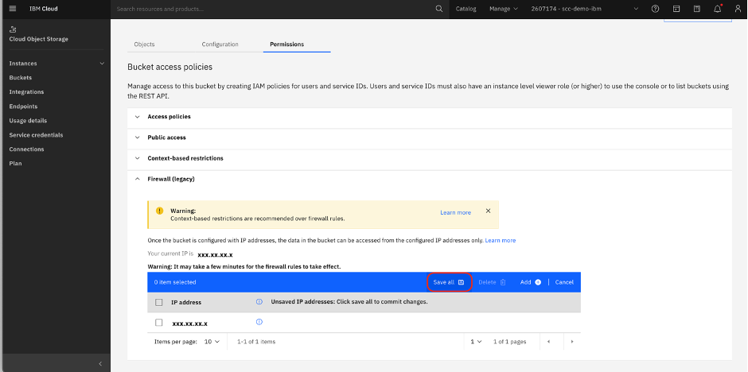