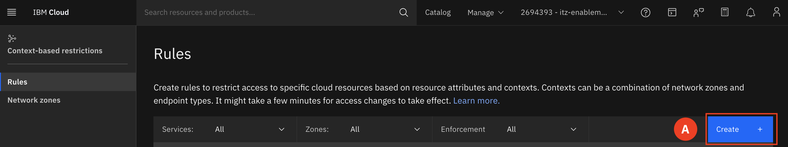
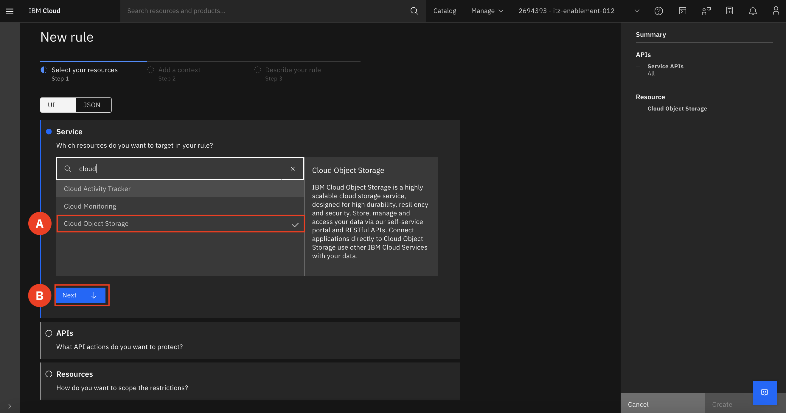
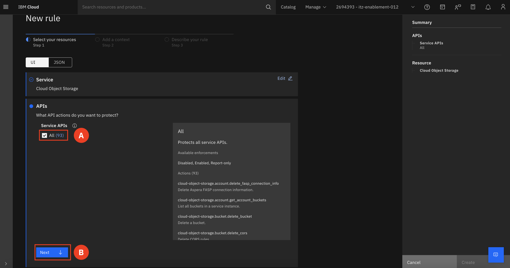
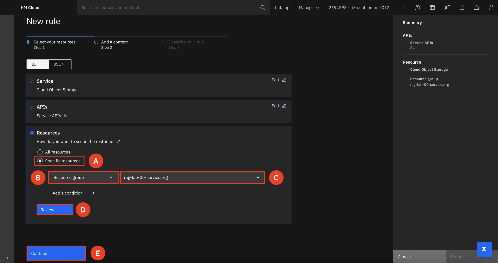
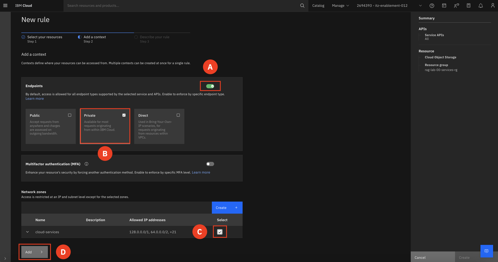
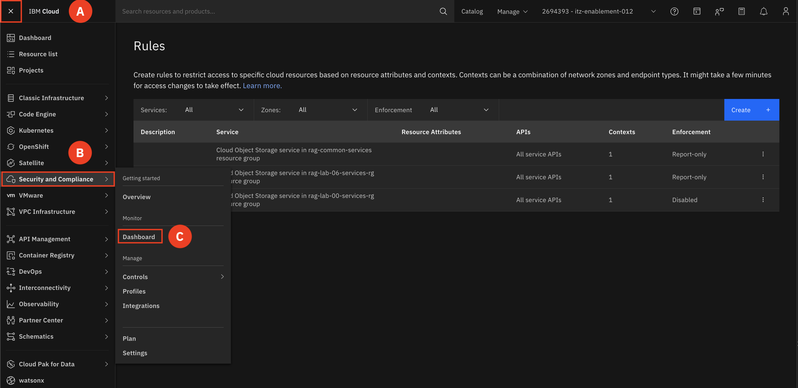
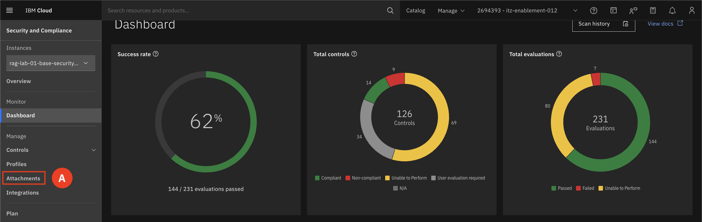
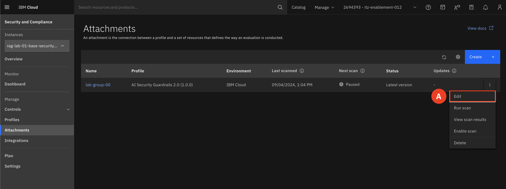
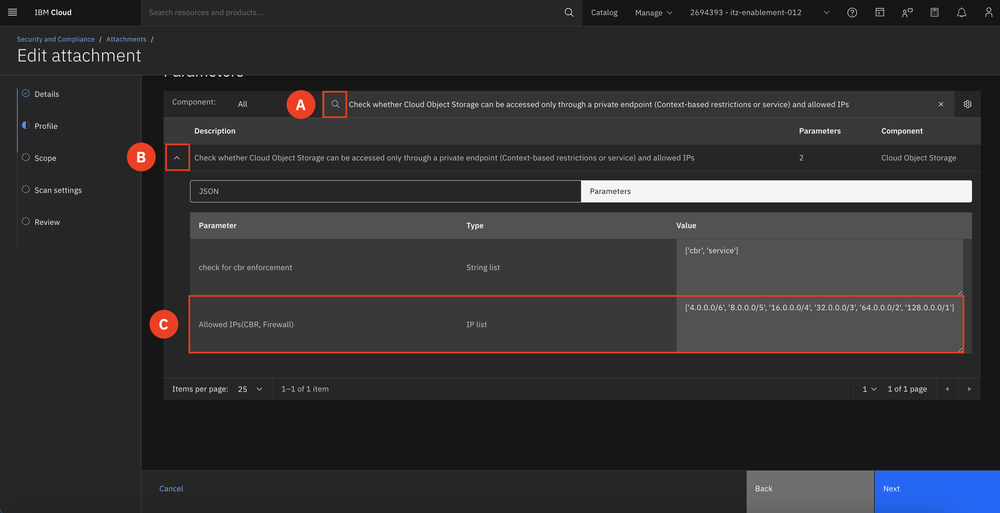
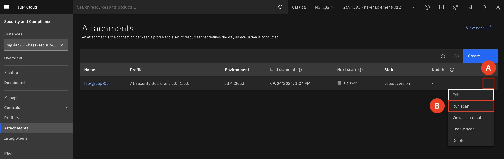

# Remediate Failed Rule

We will now walk you through how to remediate this failed rule. 

1. At the top of your screen find and expand the Manage menu (A) and select Context-based restrictions (B)

        

2. Select Rules (A)

    

3. click Create (A)

    

4. Select Cloud Object Storage (A), click next (B)

    

5. Make sure All (A) is checked for Service APIs, click Next (B)

    

6. Select Specific resource (A), in the first drop down select Resource group (B), select the resource group that matches your group number(C). Click Review (D) and then Continue (E). 

    

7. Toggle Endpoints (A) to on and select Private (B). Check the box (C) for cloud-services network zones and hit add (D)

    

8. Selected Enabled for Enforcement (A) and then click Create (B)

    

9. Expand the navigation menu (A) and hover over Security and Compliance Center (B) and select Dashboard (C)

    

10. Go to your attachment (A)

    

11. open the triple dot menu and select Edit (A)

    

12. Click next until you are on the section for Profile

13. In the search bar (A), paste in:

        Check whether Cloud Object Storage can be accessed only through a private endpoint (Context-based restrictions or service) and allowed IPs

    In the Allowed IPs (CBR, Firewall), delete the IP address that is there and paste in the following list of IP addresses (B):  

        ['4.0.0.0/6', '8.0.0.0/5', '16.0.0.0/4', '32.0.0.0/3', '64.0.0.0/2', '128.0.0.0/1']
    
    

14. Navigate through the other sections and save your changes. 

15. Rerun scan

    