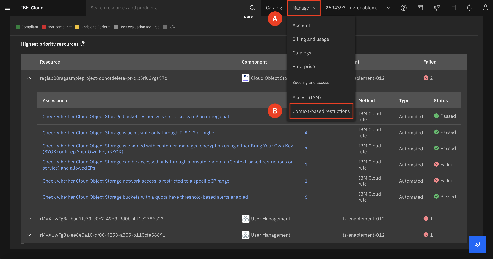
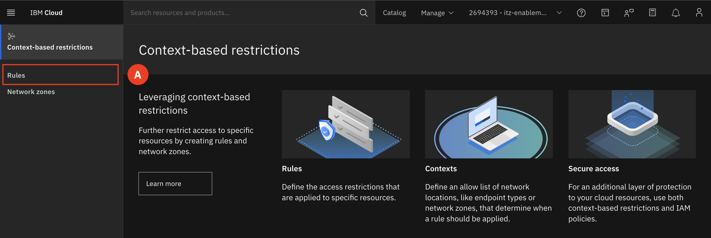
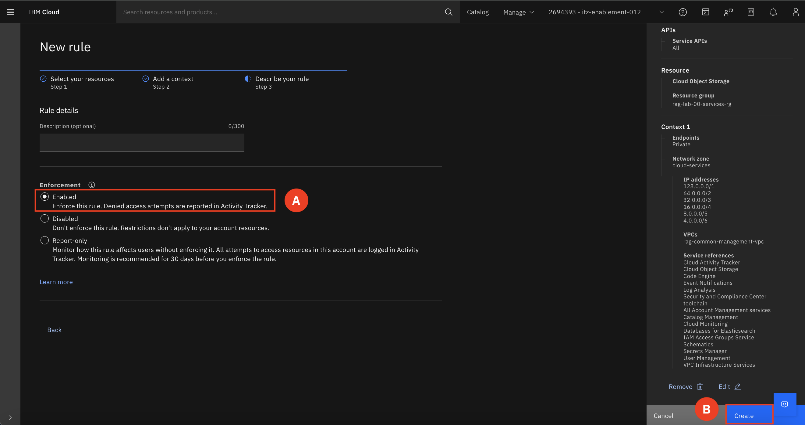

# Remediate Failed Rule

We will now walk you through how to remediate this failed rule. 

1. At the top of the screen find and expand the **Navigation menu (A)** and select **Context-based restrictions (B)**.

        

2. Select **Rules (A)**

    

3. Identify your rule based off of your group number **(A)**. 
    Example: COS endpoint restriction for rag-lab-##  

    ADD SCREENSHOT 

4. Click the **triple dot (A)** to the right of your rule and select **Edit (B)**.  

    ADD SCREENSHOT 

5. Click on **Describe your rule (A)**. Select **Enabled (B)** under Enforcement. Click Save **(C)**

    