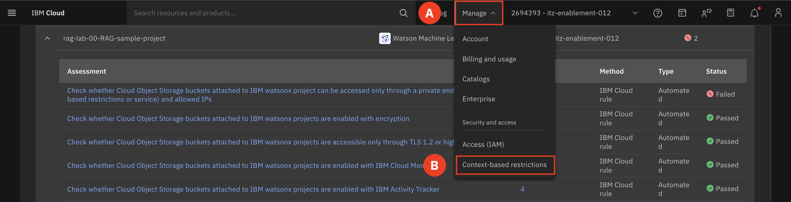
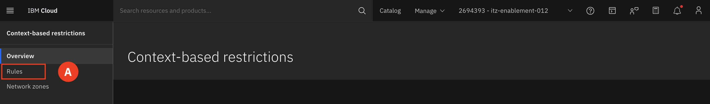
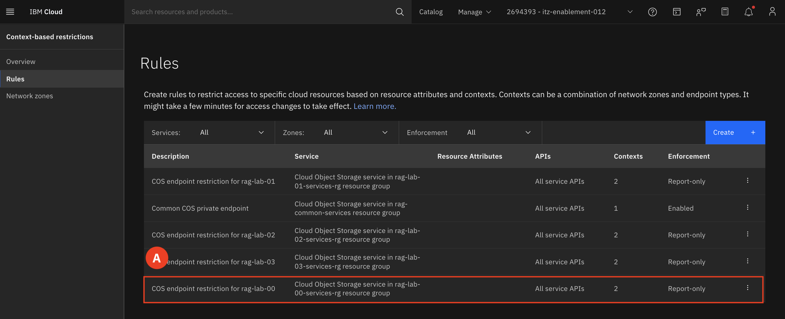
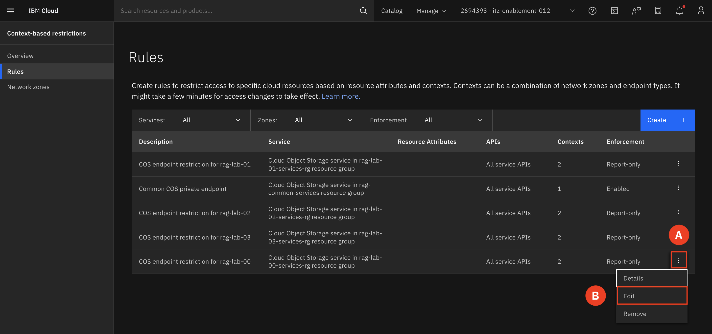

# Remediate Failed Rule

We will now walk you through how to remediate this failed rule. All lab groups are encouraged to complete specific tasks in the to achieve 100% compliance in the security scan.

1. At the top of the screen find and expand the **Navigation menu (A)** and select **Context-based restrictions (B)**.

        

2. Select **Rules (A)**

    

3. Identify your rule based off of your group number **(A)**. 
    Example: COS endpoint restriction for rag-lab-00  

    

4. Click the **triple dot (A)** to the right of your rule and select **Edit (B)**.  

    

5. Click on **Describe your rule (A)**. Select **Enabled (B)** under Enforcement. Click Save **(C)**

    

6. Select **Enabled (A)** under Enforcement. Click Save **(B)**

    