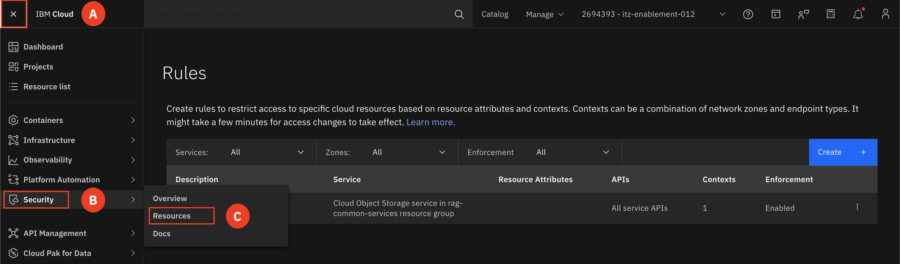
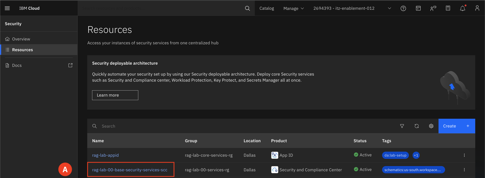
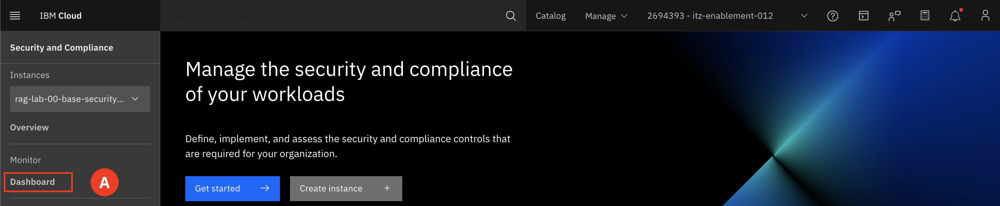
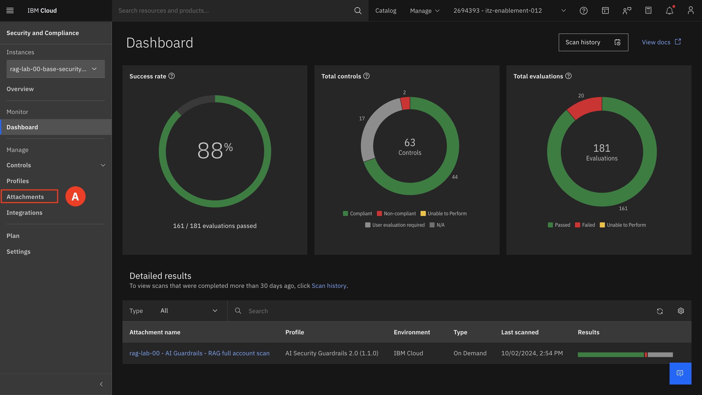
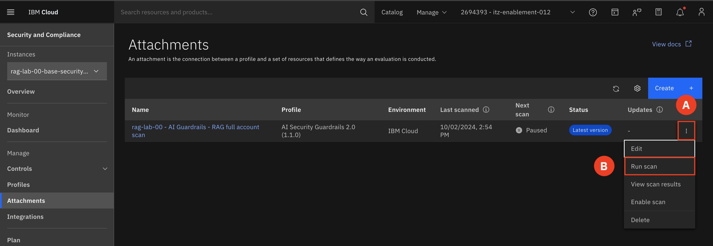
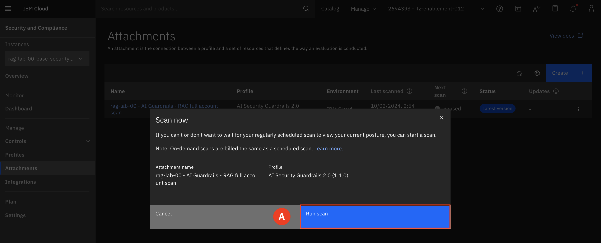
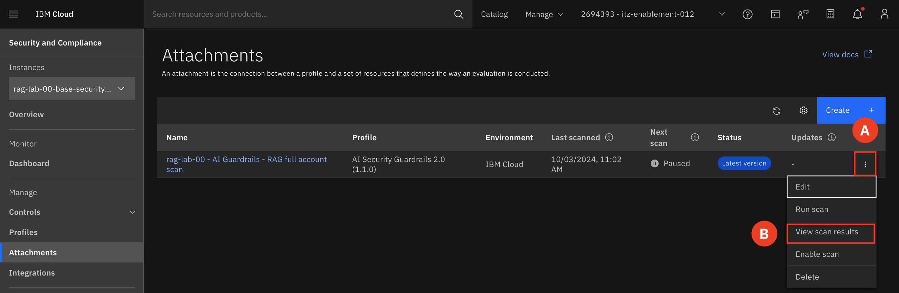
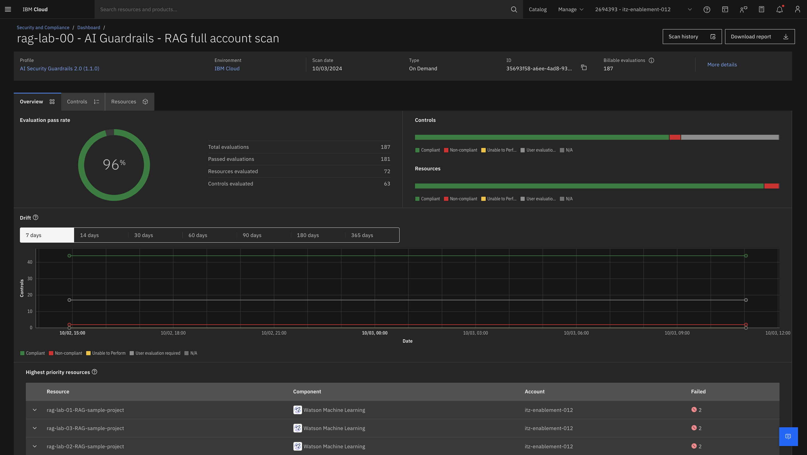

# Rescan and Validate Compliance 

Now that you have remediated the issue, lets go back and rerun the scan and obverse the improvement in compliance.

---

1. Expand the **Navigation menu (A)** and then hover over **Security (B)** and select **Resources (C).**

    

2. Select the resource **rag-lab-##-base-security-services-scc (A)** (where ## is replaced with your group number).  
For example: rag-lab-00-base-security-services-scc

   

3. Select **Dashboard (A)**
   

4. Select **Attachment (A)**

    

5. On your attachment select the **triple dot (A)** and select **Run scan (B)**.

    

6. Select **Run scan (A)**. The scan will take 5-7 minutes to complete. 

    

7. Once the scan has finished running, select the **triple dot (A)** and select **View scan results(B)**.

    

8. Select the most recent scan **(A)**

    

9. Observe the changes in the overall compliance score.

    