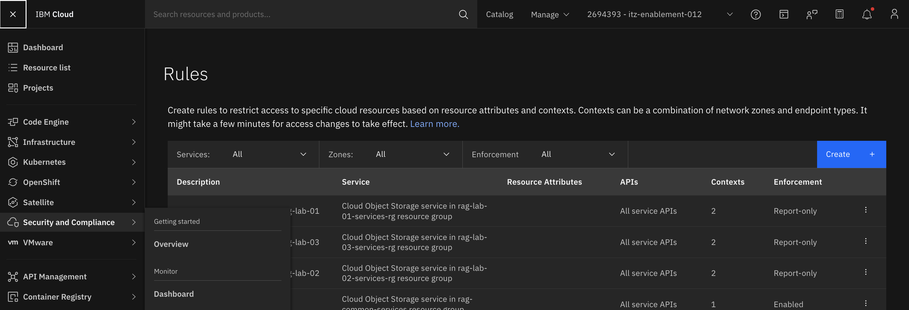
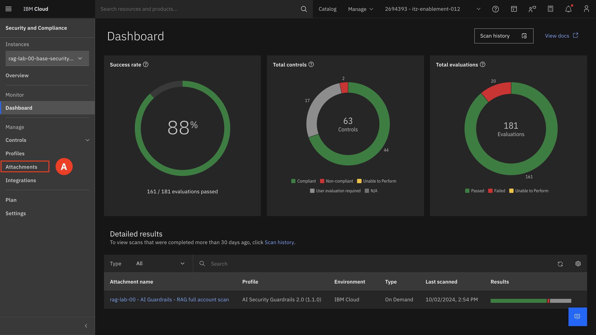
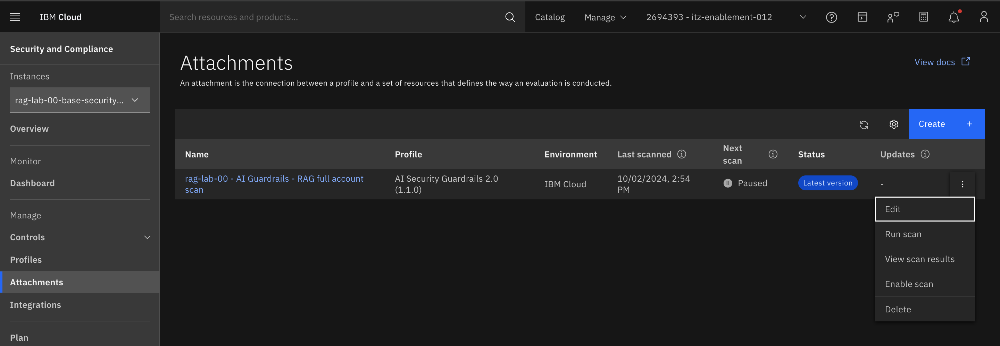
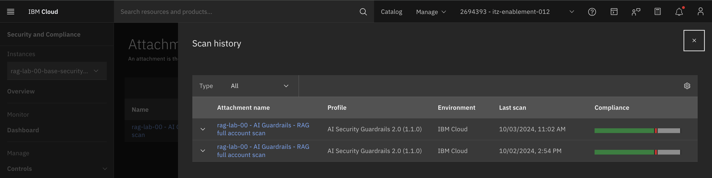
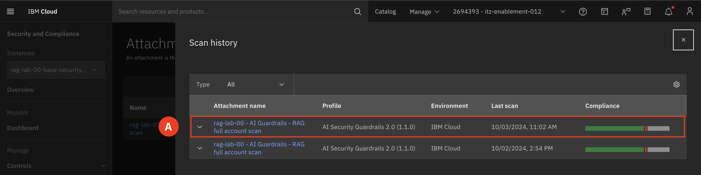
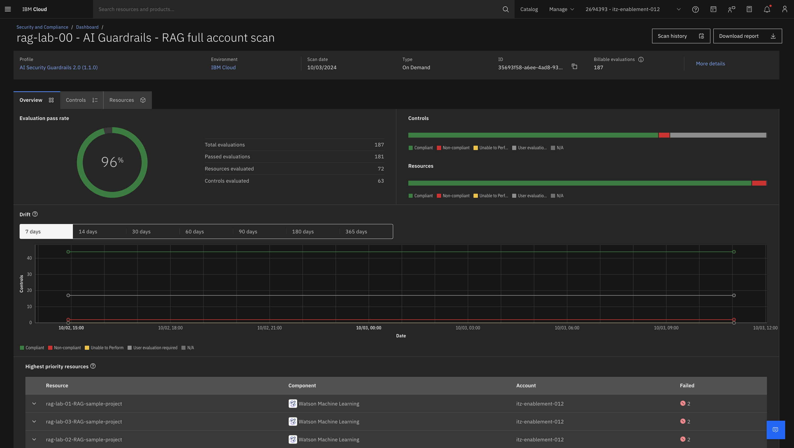

# Rescan and Validate Compliance 

Now that you have remediated the issue, lets go back and rerun the scan and obverse the improvement in compliance.

1. Expand the **Navigation menu (A)** and hover over **Security and Compliance Center (B)** and select **Dashboard (C)**.  

2. Select **Attachment (A)**

    

3. On your attachment select the **triple dot (A)** and select **Run scan(B)**.

    

4. Select **Run scan (A)**

    

5. Once the scan has finished running,  select the **triple dot (A)** and select **View scan results(B)**.

    

6. Select the most recent scan **(A)**

    

7. Observe the changes in the overall compliance score.

    