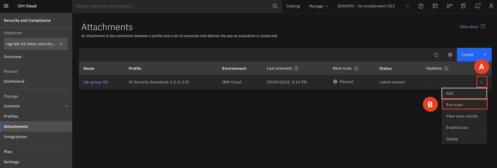
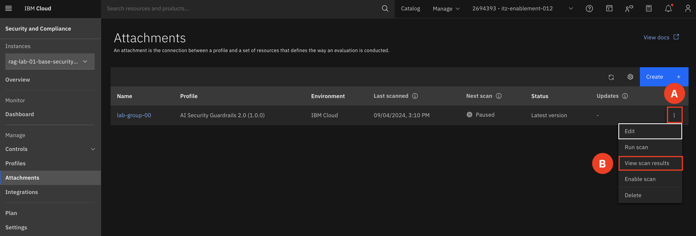
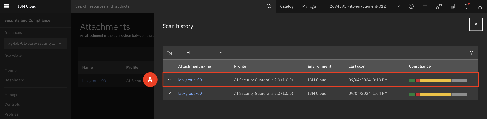
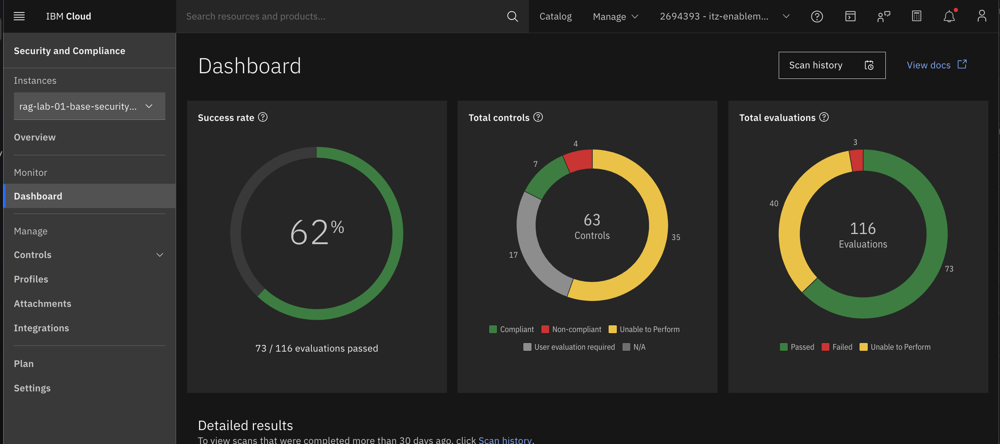

# Rescan and Validate Compliance 

1. On your attachment select the triple dot (A) and select Run scan (B). The scan will take about 5 minutes to run.

    

2. On your attachment select the triple dot (A) and select View scan results (B). 

    

3. Select the most recent scan (A)

    

4. Observe the changes in the overall compliance score. 

    