# Configure SCC Profile Attachment and Run Scan 

In this section you will create an SCC profile attachment scoped for the resource (COS bucket) you created in the previous section. The scan will assess specifications applicable to the resources in your own resources group as well as some account-level configurations. Since you have created your new resource following the control reequipments, the new resource should pass the control assessment.

Once the attachment is created, the scans can be started on demand or on schedule. Keep in mind that SCC caches the resource data for 1 hour so changes to resource configuration done after a recent scan may not be reflected in the next scan result.

1. Click to Navigation Menu > Security and Compliance > Profiles 

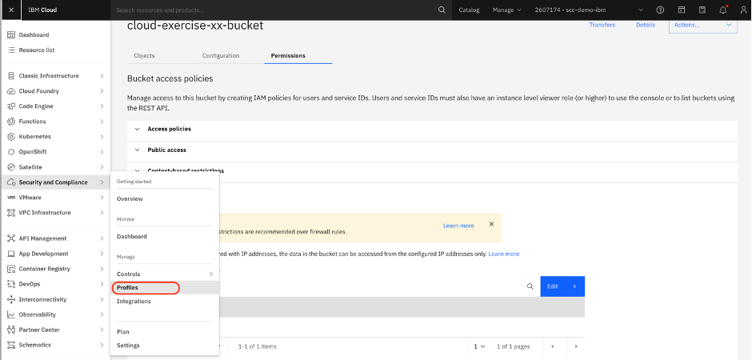

2. Select the profile 

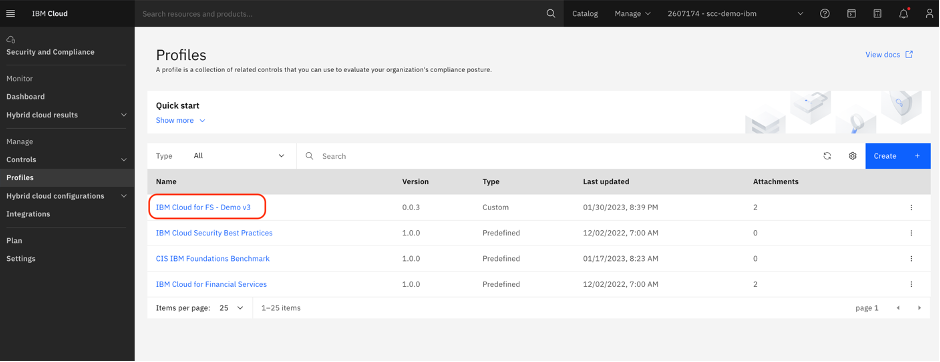

3. Select Attachments 

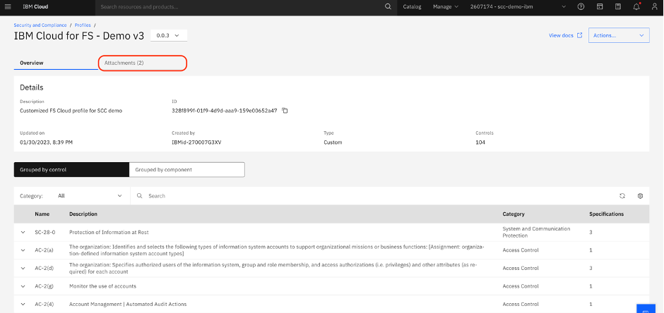

4. Click Create 

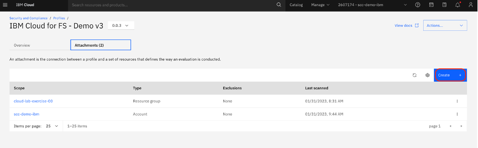

5. Under Scope select and then click Next
* Note: xx is replaced with your group number 
* Make sure to scroll through the list to find the resource group corresponding to your group number. 

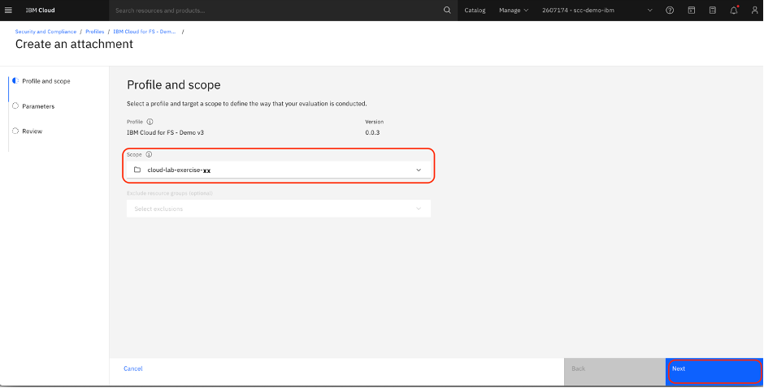

6. Click Next on Parameters 

A parameter is a specific configuration property that is evaluated. Each parameter is assigned a value by default that can be customized when an attachment is created. For example, if a control evaluates which region that a resource exits in, you can specify the region that you want to check for by defining the parameter.

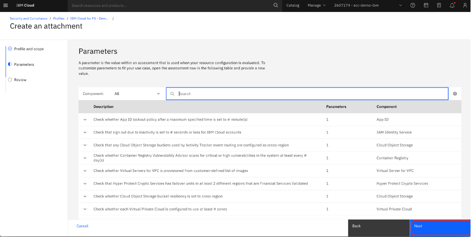

7. Click Create 

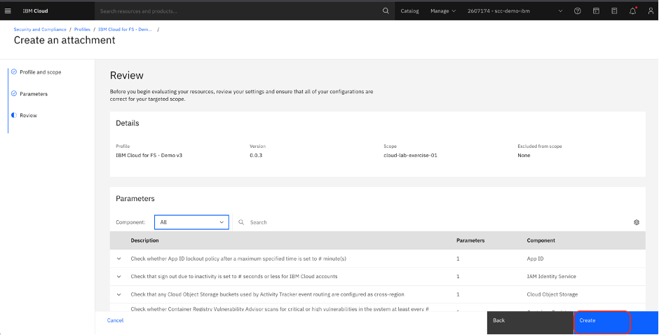

8. Locate the scope with your group number in the list. Click the three dots on the right side of the attachment and hit Run Scan. The scan will take 5-7 minutes to complete. 
* Note: Sort the Scope in descending order (arrow pointing down) to help make it easier to find your attachment.  

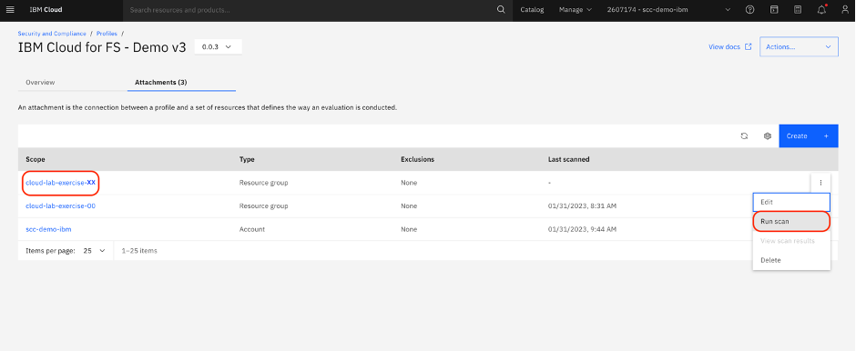

9. Click the three dots again and select View scan results 

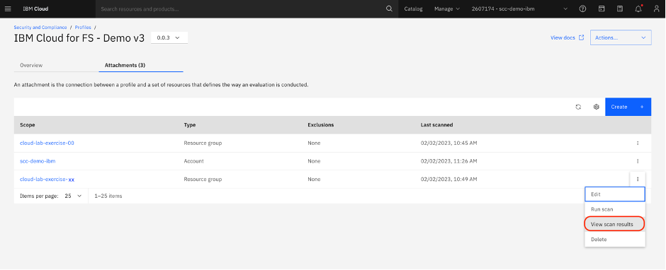

10. Click View

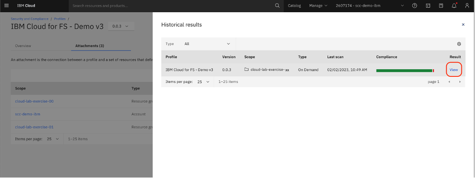

11. Observe the scan results to see that your bucket did not encounter the Cloud Object Storage error. That is due to the fact that you implemented all necessary IP settings to guarantee compliance. You can find the results of the specification assessment for your COS bucket in the Resources tab.

The iam-identity resource is still marked non-compliant since the account level configuration for MFA has not been updated and is included in your scope even when the scope is limited to a specific resource group.

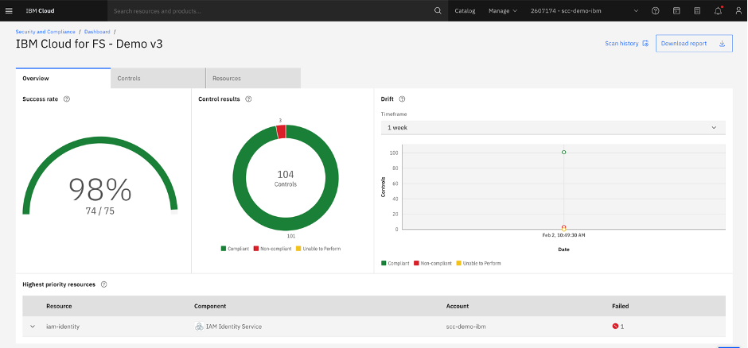

