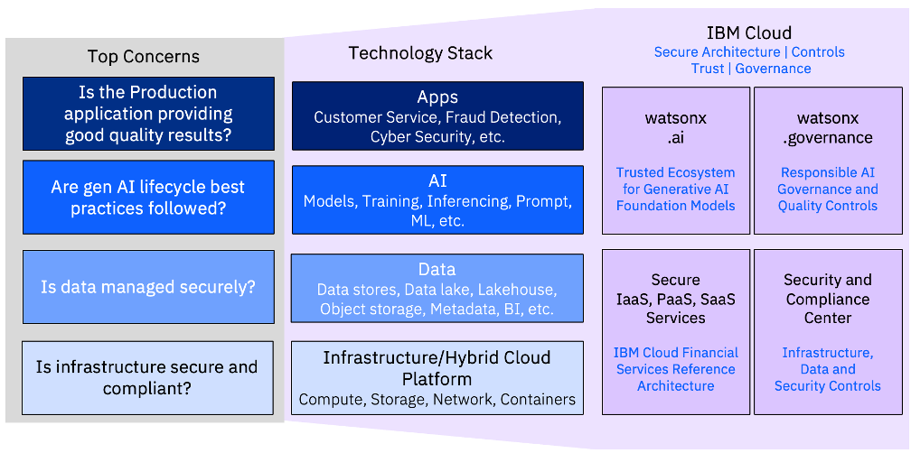

# Regulated Industries Security and Compliance in the AI Era 

## Introduction

Regulated Industries, like Financial Services, Health, Telco and Government have requirements for Gen AI to support productivity gains and higher revenue. At the same time, Regulated Industries have the highest requirements for security and compliance, so such AI opportunities can also raise trust, security and regulatory compliance risks in multiple levels: from the solution infrastructure all the way to data security and privacy, to model bias, explainability and AI robustness. In this lab you will learn how to use Deployable architectures to quickly deploy enterprise Level GenAI solution using IBM Cloud Regulated Industries with Watsonx.ai and Watsonx Governance and provide a secure and trusted environment to deploy and govern generative AI applications through their lifecycle.

Deploying enterprise level AI applications involves combining different cloud services in complex architectures which can result in security and compliance risks if not done carefully.
When building and delivering [generative AI](https://www.ibm.com/topics/generative-ai?utm_source=ibm_developer&utm_content=in_content_link&utm_id=tutorials_awb-maximize-gen-ai-on-ibm-cloud-deployable-architectures&cm_sp=ibmdev-_-developer-tutorials-_-ibmcom) (Gen AI) solutions, clients need to consider not only the AI aspects but also the infrastructure, data layers, and non-functional requirements of a complete enterprise solution. These include security, compliance, and manageability.

These and other security and governance concerns need to be addressed at the different levels of the solution, including Infrastructure, Data, AI and Apps, as shown in the picture below. IBM Cloud services, shown on the right can help provide complete Enterprise AI solutions.

[Deployable Architectures](https://www.ibm.com/blog/deployable-architecture-on-ibm-cloud-simplifying-system-deployment/?utm_source=ibm_developer&utm_content=in_content_link&utm_id=tutorials_awb-maximize-gen-ai-on-ibm-cloud-deployable-architectures&cm_sp=ibmdev-_-developer-tutorials-_-ibmcom) (DAs) can deploy the complete solution and support these non-functional requirements. DAs are automated reference architectures and solutions that allow clients to use IBM Cloud for faster deployment, enhanced security, continuous compliance, and seamless integration.

This lab guides you through the use of IBM Cloud Deployable Architecture for Retrieval Augmented Generation Pattern for watsonx (in short: RAG DA). This is a walk-through of an already deployed solution using RAG DA, so it does not actually go through the deployment, which could take a couple of hours for all the resources to be created. After the walk-through, the student will be able to interact with the environment to fix security vulnerabilities and verify control compliance for it.
